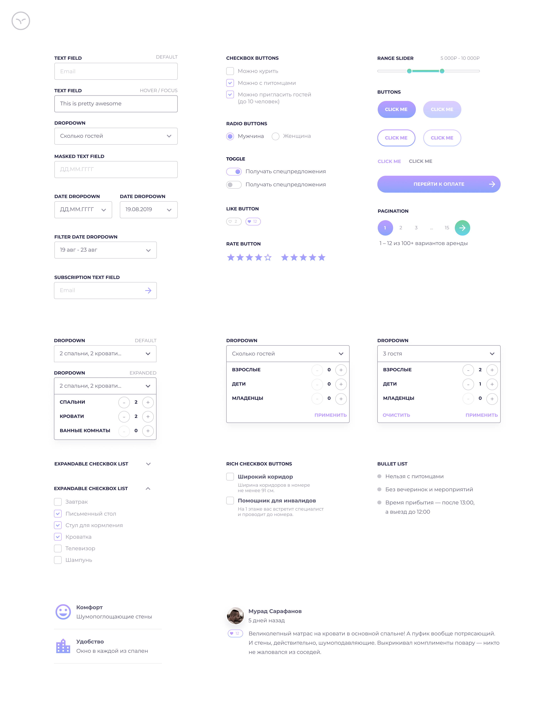
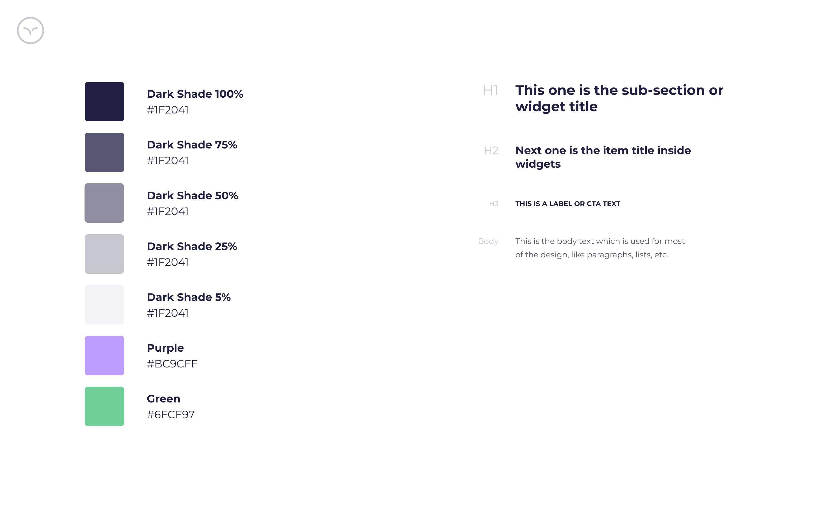
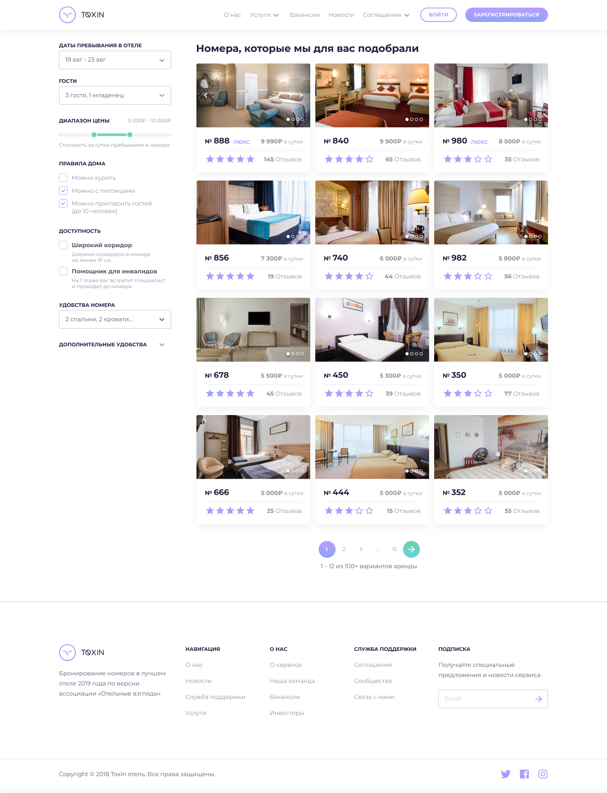

# [Toxin](https://mariezin.github.io/search-for-hotels/)
Поиск гостиничных номеров.

## Начало работы
Для начала работы склонируйте все содержимое репозитория `git clone https://github.com/MarieZin/search-for-hotels.git` Затем запустите команду `npm i`, которая установит все необходимые зависимости. Далее доступны следующие команды:
- `npm run build:dev` — сборка проекта в режиме разработки.
- `npm run build:build` — сборка продакшн-версии проекта. 
- `npm run start` — запуск сервера. 
- `slint` — запуск проверки stylelinter.
- `slint:f` — запуск проверки stylelinter с автоматическим исправлением.
- `eslint` — запуск проверки eslint.

## Тут используется:
- PUG
- Компонентная архитектура
- jQuery
- SCSS
- Webpack
- Pixel Perfect

## Библиотеки:
- [jQuery Validation ](https://jqueryvalidation.org/)
- [jQuery Nice Number](https://www.npmjs.com/package/jquery.nice-number)
- [Ion.RangeSlider](http://ionden.com/a/plugins/ion.rangeslider/index.html)
- [Inputmask](https://robinherbots.github.io/Inputmask/)
- [Air Datepicker](https://air-datepicker.com/ru)

## Макет сайта:
- [В Figma](https://www.figma.com/design/7W5R6uxAk0vCVzFZcPVegk/Untitled?t=UA9JdK1Lq5xzQqtc-0)

## Готовые страницы:
<table>
    <tr valign="top">
        <td>
            <a href='https://mariezin.github.io/search-for-hotels/form-elements.html'>Form Elements</a>  
            
        </td>
        <td>
            <a href='https://mariezin.github.io/search-for-hotels/cards.html'>Cards</a>  
            
        </td>
        <td>
            <a href='https://mariezin.github.io/search-for-hotels/colors-type.html'>Colors & Type</a>  
            
        </td>
        <td>
            <a href='https://mariezin.github.io/search-for-hotels/headers-footers.html'>Headers & Footers</a>  
            
        </td>
    </tr>
    <tr valign="top">
        <td>
            <a href='https://mariezin.github.io/search-for-hotels/index.html'>Landing page</a>  
            
        </td>
        <td>
            <a href='https://mariezin.github.io/search-for-hotels/search-room.html'>Search room/Filter</a>  
            
        </td>
        <td>
            <a href='https://mariezin.github.io/search-for-hotels/room-details.html'>Room details</a>  
            
        </td>
        <td>
            <a href='https://mariezin.github.io/search-for-hotels/user-registration.html'>Registration</a>  
            
        </td>
    </tr>
    <tr valign="top">
        <td>
            <a href='https://mariezin.github.io/search-for-hotels/user-login.html'>Sign in</a>  
            
        </td>
    </tr>
</table>
